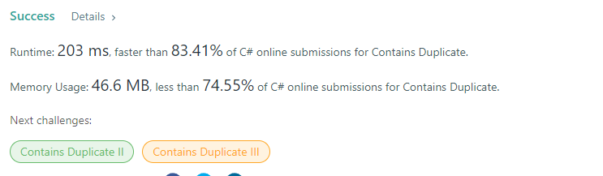

# Leet Code Everyday

## Set up

- Install

```js
yarn
// or
npm i
```

- Preview in web browser

```js
yarn serve
// or
npm run serve
```

## Resove Problem

### Day 1

- [Contains Duplicate](day_one/day-one.md)
  
  