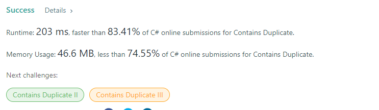
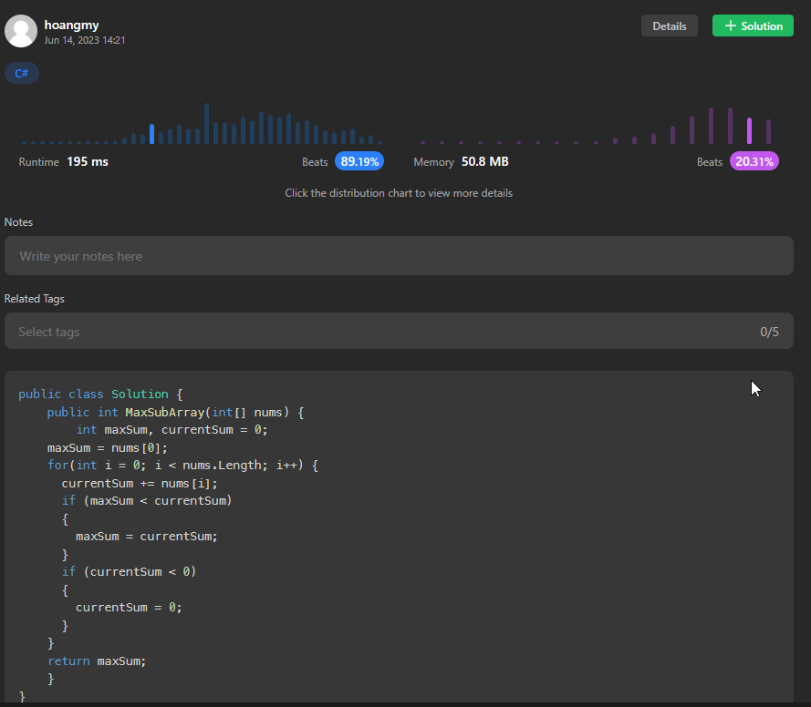

# Leet Code Everyday

## Run file

```powershell
dotnet run -c Release --filter *
```

## Data Structure I

### Resolve Problem

#### Day 1

- [Contains duplicate (easy)](day-one/day-one.md)
  
  
- [Maximum sub array (medium)](day-one/day-one.md)
  

### Set up document

- Install

```js
yarn
// or
npm i
```

- Preview in web browser

```js
yarn serve
// or
npm run serve
```